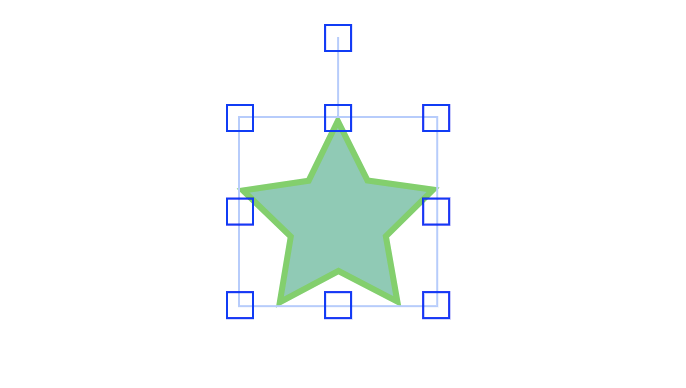
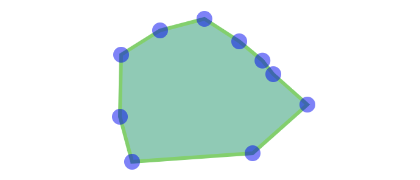

[Polygon](https://developer.mozilla.org/zh-CN/docs/Web/SVG/Element/polygon) 是一种 [SVG 元素](https://developer.mozilla.org/zh-CN/docs/Web/SVG/Element)，它是由一组 Point（端点坐标） 按照先后顺序、通过直线相连而构成的闭合多边形，如图 1 所示的「五角星」。

```xml
<svg width="300" height="180">
  <polygon fill="green" stroke="orange" stroke-width="1" points="0,0 100,0 100,100 0,100 0,0"/>
</svg>
```


图 1

在使用 [fabric.js](http://fabricjs.com) 的过程中，默认只能选中整个图形，且只有固定的控制点供我们操作，如图 2 所示：


图 2

我们希望能展示更多的控制点，提高图形自定义程度。首先想到的：由于 Polygon 是由一组端点坐标构成的，最起码做到将每个端点转换为控制点，最终实现图 3 的效果。


图 3

## 实现

首先，获取目标图形所包含的端点坐标。

```js
const polygon = fabricCanvas.getActiveObject();
if (!polygon || !polygon.points) {
  return;
}

const points = polygon.points;
```

其次，遍历端点坐标，并转换为 fabric.js 的控制点。

```js
// http://fabricjs.com/custom-controls-polygon
function polygonPositionHandler(dim, finalMatrix, fabricObject) {
  var x = fabricObject.points[this.pointIndex].x - fabricObject.pathOffset.x,
    y = fabricObject.points[this.pointIndex].y - fabricObject.pathOffset.y;
  return fabric.util.transformPoint(
    {
      x: x,
      y: y,
    },
    fabric.util.multiplyTransformMatrices(
      fabricObject.canvas.viewportTransform,
      fabricObject.calcTransformMatrix()
    )
  );
}

function actionHandler(eventData, transform, x, y) {
  var polygon = transform.target,
    currentControl = polygon.controls[polygon.__corner],
    mouseLocalPosition = polygon.toLocalPoint(
      new fabric.Point(x, y),
      "center",
      "center"
    ),
    polygonBaseSize = polygon._getNonTransformedDimensions(),
    size = polygon._getTransformedDimensions(0, 0),
    finalPointPosition = {
      x:
        (mouseLocalPosition.x * polygonBaseSize.x) / size.x +
        polygon.pathOffset.x,
      y:
        (mouseLocalPosition.y * polygonBaseSize.y) / size.y +
        polygon.pathOffset.y,
    };
  polygon.points[currentControl.pointIndex] = finalPointPosition;
  return true;
}

function anchorWrapper(anchorIndex, fn) {
  return function (eventData, transform, x, y) {
    var fabricObject = transform.target,
      absolutePoint = fabric.util.transformPoint(
        {
          x: fabricObject.points[anchorIndex].x - fabricObject.pathOffset.x,
          y: fabricObject.points[anchorIndex].y - fabricObject.pathOffset.y,
        },
        fabricObject.calcTransformMatrix()
      ),
      actionPerformed = fn(eventData, transform, x, y),
      newDim = fabricObject._setPositionDimensions({}),
      polygonBaseSize = fabricObject._getNonTransformedDimensions(),
      newX =
        (fabricObject.points[anchorIndex].x - fabricObject.pathOffset.x) /
        polygonBaseSize.x,
      newY =
        (fabricObject.points[anchorIndex].y - fabricObject.pathOffset.y) /
        polygonBaseSize.y;
    fabricObject.setPositionByOrigin(absolutePoint, newX + 0.5, newY + 0.5);
    return actionPerformed;
  };
}

polygon.controls = polygon.points.reduce((acc, point, index) => {
  acc[`p${index}`] = new fabric.Control({
    positionHandler: polygonPositionHandler,
    actionHandler: anchorWrapper(
      index > 0 ? index - 1 : polygon.points.length,
      actionHandler
    ),
    actionName: "modifyPolygon",
    pointIndex: index,
  });
  return acc;
});
```

最后，重新渲染视图。

```js
fabricCanvas.requestRenderAll()
```

## 参考

1. [http://fabricjs.com/custom-controls-polygon](http://fabricjs.com/custom-controls-polygon)
2. [http://fabricjs.com/controls-api](http://fabricjs.com/controls-api)
