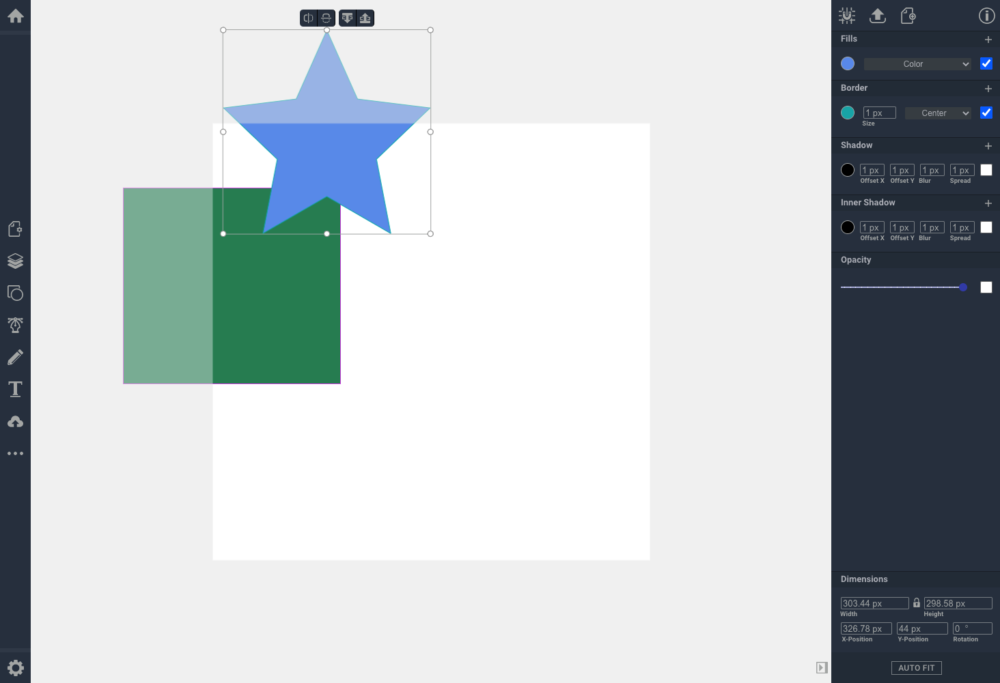

# fabric.js 透明工作区

## 实现
```ts
/**
 * NOTE: 可见画板区域，其余为不可见区域（导出时不会被保留）。
 */
export const setupWorkspace = ({
  width = 600,
  height = 600,
  showRightPanel = true,
} = {}) => {
  const LEFT_TOOLBAR_WIDTH = 45;
  const RIGHT_PROPERTY_PANEL_WIDTH = showRightPanel ? 250 : 0;
  /**
   * 矩形中心 left: (WINDOW_WIDTH - LEFT_SIDEBAR - $RIGHT_SIDEBAR) / 2 + LEFT_SIDEBAR
   * left = 矩形中心 left - width / 2
   */
  const centerX =
    (window.innerWidth - LEFT_TOOLBAR_WIDTH - RIGHT_PROPERTY_PANEL_WIDTH) / 2 +
    LEFT_TOOLBAR_WIDTH;
  const centerY = window.innerHeight / 2;

  const canvas = window.Vectr.fabricCanvas;
  const clipingRect = new fabric.Rect({
    originX: "left",
    originY: "top",
    top: centerY - height / 2,
    left: centerX - width / 2,
    height,
    width,
    fill: "white",
    selectable: false,
    stroke: "#bfbfbf",
    strokeWidth: 1,
  });
  canvas.backgroundColor = "rgba(255, 255, 255, 0.5)";
  canvas.setBackgroundImage(clipingRect as any, () => {});
};
```

## 效果

